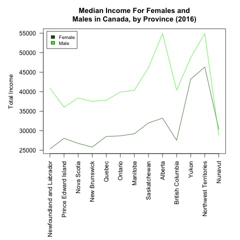

# Statistics on Gender-based Income Inequality

An investigation into the statistical significance in the difference between median total incomes for female and male income recipients in Canada.

### Acknowledgments

- __Data retrieved from__ the [Government of Canada Open Data](https://open.canada.ca/data/en/dataset/a1b8373c-522a-4cce-87c7-a2bc8b9530e7) database
